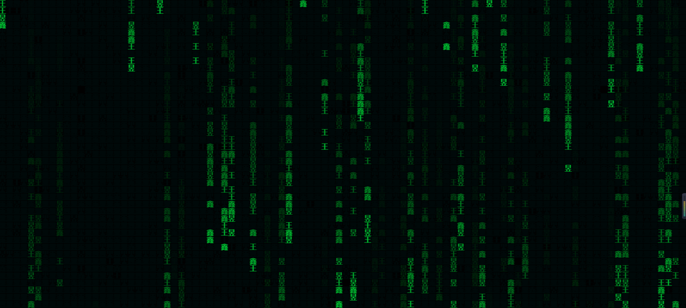

# 代码雨

```
<!DOCTYPE html>
<html lang="en">
<head>
    <meta charset="UTF-8">
    <meta name="viewport" content="width=\, initial-scale=1.0">
    <meta http-equiv="X-UA-Compatible" content="ie=edge">
    <title>Document</title>
    <style>
        * {
            padding:0;
            margin:0
        }
        html {
            overflow:hidden
        }
    </style>
</head>
<body>
    <canvas id="canvas" style="background:#111"></canvas>
</body>
<script>
    window.onload = function() {
        //获取画布对象
        var canvas = document.getElementById("canvas");
        //获取画布的上下文
        var context = canvas.getContext("2d");
        //获取浏览器屏幕的宽度和高度
        var W = window.innerWidth;
        var H = window.innerHeight;
        //设置canvas的宽度和高度
        canvas.width = W;
        canvas.height = H;
        //每个文字的字体大小
        var fontSize = 16;
        //计算列
        var colunms = Math.floor(W / fontSize);
        //记录每列文字的y轴坐标
        var drops = [];
        //给每一个文字初始化一个起始点的位置
        for (var i = 0; i < colunms; i++) {
            drops.push(0);
        }

        //运动的文字
        var str = "王 昱 鑫";
        //4:fillText(str,x,y);原理就是去更改y的坐标位置
        //绘画的函数
        function draw() {
            context.fillStyle = "rgba(0,0,0,0.05)";
            context.fillRect(0, 0, W, H);
            //给字体设置样式
            context.font = "700 " + fontSize + "px  微软雅黑";
            //给字体添加颜色
            context.fillStyle = "#00cc33"; //可以rgb,hsl, 标准色，十六进制颜色
            //写入画布中
            for (var i = 0; i < colunms; i++) {
                var index = Math.floor(Math.random() * str.length);
                var x = i * fontSize;
                var y = drops[i] * fontSize;
                context.fillText(str[index], x, y);
                //如果要改变时间，肯定就是改变每次他的起点
                if (y >= canvas.height && Math.random() > 0.99) {
                    drops[i] = 0;
                }
                drops[i]++;
            }
        };

        function randColor() {
            var r = Math.floor(Math.random() * 256);
            var g = Math.floor(Math.random() * 256);
            var b = Math.floor(Math.random() * 256);
            return "rgb(" + r + "," + g + "," + b + ")";
        }

        draw();
        setInterval(draw, 30);
    };
</script>
</html>
```
